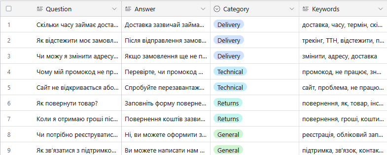

# FAQ Table Structure

## Airtable Setup
- **Base**: Chatbot FAQ
- **Table**: FAQ
- **Columns**:
  - Question (Single line text)
  - Answer (Long text)
  - Category (Single select: Доставка, Технічне, Повернення, Загальне)
  - Keywords (Long text)

## Example Data
| Question                  | Answer                                              | Category    | Keywords                |
|---------------------------|----------------------------------------------------|-------------|-------------------------|
| Як відстежити замовлення? | Використовуйте посилання з листа підтвердження.    | Доставка    | відстеження, замовлення |

## API Access
- Base ID: appXXXXXXXXXXXXXX
- Table ID: tblXXXXXXXXXXXXXX
- API Key: Stored in .env

## Screenshot
